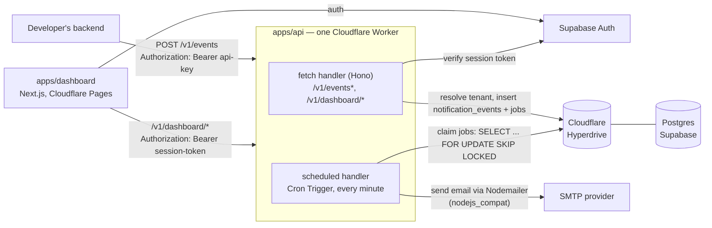

# Phase 1 Architecture Diagram

```mermaid
flowchart LR
    Client[Developer's backend] -- "POST /v1/events\nAuthorization: Bearer api-key" --> Worker
    Dashboard[apps/dashboard\nNext.js, Cloudflare Pages] -- "auth" --> SupabaseAuth[Supabase Auth]
    Dashboard -- "/v1/dashboard/*\nAuthorization: Bearer session-token" --> Worker

    subgraph Worker["apps/api — one Cloudflare Worker"]
        Fetch["fetch handler (Hono)\n/v1/events*, /v1/dashboard/*"]
        Scheduled["scheduled handler\nCron Trigger, every minute"]
    end

    Fetch -- "resolve tenant, insert notification_events + jobs" --> Hyperdrive[(Cloudflare\nHyperdrive)]
    Scheduled -- "claim jobs: SELECT ... FOR UPDATE SKIP LOCKED" --> Hyperdrive
    Scheduled -- "send email via Nodemailer\n(nodejs_compat)" --> SMTP[SMTP provider]
    Hyperdrive --- DB[(Postgres\nSupabase)]
    Fetch -- "verify session token" --> SupabaseAuth
```
