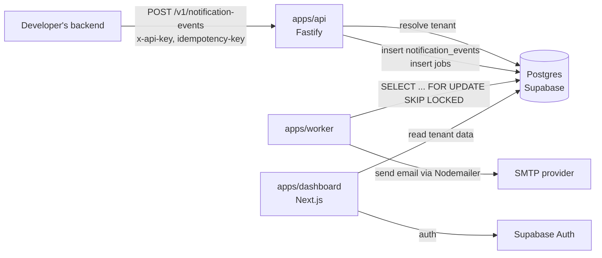

# Phase 1 Architecture Diagram

```mermaid
flowchart LR
    Client[Developer's backend] -- "POST /v1/notification-events\nx-api-key, idempotency-key" --> API[apps/api\nFastify]
    API -- "resolve tenant" --> DB[(Postgres\nSupabase)]
    API -- "insert notification_events\ninsert jobs" --> DB
    Worker[apps/worker] -- "SELECT ... FOR UPDATE SKIP LOCKED" --> DB
    Worker -- "send email via Nodemailer" --> SMTP[SMTP provider]
    Dashboard[apps/dashboard\nNext.js] -- "auth" --> SupabaseAuth[Supabase Auth]
    Dashboard -- "read tenant data" --> DB
```
